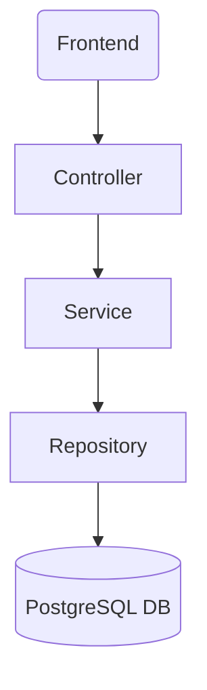

# Personal Finance API
A RESTful API for managing personal finances, built with Java Spring Boot and PostgreSQL.

## Overview
Full-stack personal finance management application designed to help users track their income, 
expenses, budgets, and saving goals. This repository contains the backend API built with modern 
Java technologies and industry best practices.

Related Repository: 
  [Personal Finance Application - Frontend](https://github.com/ChrisFloresM/personal-finance-frontend)

## Key Features
* **Transaction Management:** Complete CRUD operations for income and expense tracking.
* **Saving Goals (Pots):** Set and track progress toward financial goals.
* **Secure authentication:** JWT-based authentication integrated with Auth0 as authorization server.
* **RESTFUL Architecture:** Clean, well-documented API endpoints
* **Data validation:** Comprehensive input validation and error handling
* **Database integration:** PostgreSQL with JPA/Hibernate for robust data persistence
* **Pagination:** For large datasets of user transactions
* **Sorting and filtering:** Features to sort and filter user transactions by different 
  categories and parameters.
* **Budget planning to create and monitor budgets with category-based allocation.

### In development:


## Tech Stack
* **Java 25** - Modern Java features and performance
* **Spring Boot 4.0** - Application framework
* **Spring Security** - Authentication
* **Spring Data JPA** - Data access layer with Hibernate
* **PostgreSQL** - Relational database
* **Docker** - Database containerization

## Authentication & Security
* **Auth0** - Identity management platform
* **JWT** - Stateless authentication tokens

##Build & Development Tools
* **Maven** - Dependency management and build automation
* **Postman** - API testing and documentation

## Architecture


## Project Structure
``` bash
src
│   ├───main
│   │   ├───java
│   │   │   └───com.cfloresh.springboot.app
│   │   │       └───personalFinance
│   │   │           └───configuration
│   │   │           ├──controller
│   │   │           ├───dto
│   │   │           ├───exception
│   │   │           ├───mapper
│   │   │           ├───model
│   │   │           ├───repository
│   │   │           └───service
│   │   └───resources
│   └───test
```

## API Endpoints

### Transactions

#### POST /api/transactions
Register a new transaction

**Request Body:**
```json
{
  "avatar": "avatar/example/path",
  "name": "transactionName",
  "category_id": 1,
  "date": "yyyy-mm-dd",
  "amount": 100.00,
  "recurring": false
}
```

**Response (201 CREATED):**
```json
{
  "avatar": "avatar/example/path",
  "name": "transactionName",
  "category_id": 1,
  "date": "yyyy-mm-dd",
  "amount": 100.00,
  "recurring": false
}
```

**ERRORS:**
- `401 Unauthorized` - Invalid JWT (user not correctly authenticated)
- `400 Bad Request` - Invalid request body


#### GET /api/transactions
Get all the transactions for the authenticated users and provides them with the filter, sorting 
and pagination configurations given the Query parameters.

**Query parameters:**
```markdown
| Param      | Type            | Required | Default | Description                                                                                                   |
|------------|-----------------|----------|---------|---------------------------------------------------------------------------------------------------------------|
| page       | int             | false    | 0       | Indicates the page number.                                                                                    |
| sortBy     | TransactionSort | false    | LATEST  | Indicates the sort mechanism.                                                                                 |
| categoryId | Long            | false    | 0       | Represent the id of the category to use. 0 is mainly used for filter purposes and means "All transactions".   |
| search     | String          | false    | ""      | Represents a search term to filter categories, applied over the 'name' field of the entity.                   |                |
```

**Request example:**
```bash
GET /api/transactions?page=0&categoryId=0&sortBy=LATEST
```

**Response (200 OK):**
```json
{
  "transactions": [
    {
      "transactionId": 60,
      "avatar": "avatar/example/path",
      "name": "transactionName",
      "category": {
        "id": 9,
        "key": "general",
        "label": "General"
      },
      "date": "2026-01-08",
      "amount": -198.00,
      "recurring": false
    },
    {
      "transactionId": 59,
      "avatar": "avatar/example/path",
      "name": "transactionName",
      "category": {
        "id": 5,
        "key": "transportation",
        "label": "Transportation"
      },
      "date": "2026-01-06",
      "amount": -123.00,
      "recurring": false
    }
  ]
}
```

**Allowed values for sortBy:**
- 'LATEST' - Most recent first
- 'OLDEST' - Oldest first
- 'ATOZ' - Alphabetical order A to Z
- 'HIGHEST' - Higher amount first. Higher incomes will show first (positive value).
- 'LOWEST' - Lower amount first. Higher expenses will show first (negative value).

**ERRORS:**
- `401 Unauthorized` - Invalid JWT (user not correctly authenticated)
- `400 Bad Request` - Invalid parameteres

#### PUT api/transactions/{transactionId}
Modify/Update a transaction with the id **transactionId** with the received data from request body.

**Request Body:**
```json
{
  "avatar": "avatar/example/newPath",
  "name": "newTransactionName",
  "category_id": 2,
  "date": "yyyy-mm-dd",
  "amount": 200.00,
  "recurring": true
}
```

**Response (201 CREATED):**
```json
{
  "avatar": "avatar/example/newPath",
  "name": "newTransactionName",
  "category_id": 2,
  "date": "yyyy-mm-dd",
  "amount": 200.00,
  "recurring": true
}
```

**ERRORS:**
- `401 Unauthorized` - Invalid JWT (user not correctly authenticated)
- `400 Bad Request` - Invalid parameteres

DELETE api/transactions/{transactionId}

Delete the transaction with the id **transactionId**.

**Response (204 - NO CONTENT)**

### Pots

#### POST api/pots

Register a new pot

**Request Body:**
```json
{
  "name": "potName",
  "target": 1000,
  "total": 0.0,
  "theme": "#277C68"
}
```

**Response (201 CREATED):**
```json
{
  "name": "potName",
  "target": 1000,
  "total": 0.0,
  "theme": "#277C68"
}
```

**ERRORS:**
- `401 Unauthorized` - Invalid JWT (user not correctly authenticated)
- `400 Bad Request` - Invalid request body

GET api/pots
Get all the transactions from the authenticated user. 

**Request example:**
```bash
GET /api/pots
```

**Response (200 OK):**
```json
[
    {
      "id": 15,
      "name": "Rainy Days",
      "target": 1234.00,
      "total": 899.00,
      "theme": "#97A0AC"
    },
    {
      "id": 16,
      "name": "New laptop",
      "target": 2000.00,
      "total": 100.00,
      "theme": "#97A0AC"
    }
]
```

**ERRORS:**
- `401 Unauthorized` - Invalid JWT (user not correctly authenticated)

#### PUT api/pots/{potId}
Modify/Update a pot with the id **potId** with the received data from request body.

**Request Body:**
```json
{
  "name": "newPotName",
  "target": 2000,
  "total": 0.0,
  "theme": "#277C68"
}
```

**Response (201 CREATED)**
```json
{
  "potId": 1,
  "name": "newPotName",
  "target": 2000,
  "total": 0.0,
  "theme": "#277C68"
}
```

**ERRORS:**
- `401 Unauthorized` - Invalid JWT (user not correctly authenticated)
- `400 Bad Request` - Invalid request body

#### DELETE api/pots/{potId}

Delete the pot with the id **potId**

**Response (204 - NO CONTENT)**


